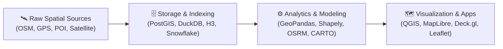

# 🗺️ Awesome Location Intelligence

<p align="center">
  
</p>

<p align="center">
  <a href="https://github.com/ishandutta2007/Awesome-Awesome-Awesome"></a><a href="https://discord.gg/jc4xtF58Ve"></a>
  <a href="https://github.com/ishandutta2007/Awesome-Location-Intelligence/stargazers"></a>
  <a href="https://github.com/ishandutta2007/Awesome-Location-Intelligence/network/members"></a>
  <a href="https://github.com/ishandutta2007/Awesome-Location-Intelligence/blob/main/LICENSE"></a>
  <a href="https://github.com/ishandutta2007/Awesome-Location-Intelligence/pulls"></a>
  <a href="https://github.com/ishandutta2007"></a>
</p>

---

## 📌 Overview & Scope

> **A curated directory of premier SaaS platforms and high-performance open-source GitHub projects in Location Intelligence, Spatial Analytics, GIS, Foot-Traffic Insights, Site Selection, Geocoding, and Geospatial Data Science.**

Location Intelligence (LI) integrates spatial engineering with data analytics, helping commercial enterprises, researchers, and government organizations examine geographic patterns. Applications range from retail catchment modeling and automated route dispatching to environmental risk assessment and human mobility tracking.

---

## 📑 Table of Contents

- [🌐 Market Landscape & SaaS Platforms](#-market-landscape--saas-platforms)
- [⚡ Open-Source GitHub Projects](#-open-source-github-projects)
- [🛠️ Architectural Stacks & Workflows](#️-architectural-stacks--workflows)
- [🤝 How to Contribute](#-how-to-contribute)
- [📈 Star History](#-star-history)
- [💖 Support & Sponsoring](#-support--sponsoring)
- [⚖️ Disclaimer & Data Governance](#️-disclaimer--data-governance)

---

## 🌐 Market Landscape & SaaS Platforms

> 📊 **Sector Economics & Fragmentation**: The global Location Intelligence market is estimated at **$28.36 Billion in 2026** (expanding at an expected **13.2%–15.5% CAGR**). The sector is **moderately fragmented**: while legacy GIS remains anchored by established enterprise players like Esri and Precisely, the rise of warehouse-native cloud analytics (CARTO), modern developer mapping APIs (Mapbox), and specialized human mobility and POI analytics engines (Placer.ai, SafeGraph, Unacast) prevents a single "winner-take-all" monopoly, fostering distinct best-of-breed verticals.

The table below catalogs commercial location intelligence platforms, sorted in descending order by company scale (valuation / annual revenue):

| 🏢 Platform / Company | 📈 Company Scale (Valuation / Revenue) | 🏷️ Starting Pricing | 🎁 Free Tier / Trial Limits |
| :--- | :--- | :--- | :--- |
| **[Esri ArcGIS](https://www.esri.com/)**<br>Industry-standard enterprise GIS, spatial modeling, mapping, and ArcGIS Online/Enterprise suites. | **Valuation: ~$15.0B**<br>(~$1.8B+ Annual Revenue) | **$100/year** (Personal Use); **$550/user/year** (ArcGIS Online Creator seat; Viewer at $110/user/year) | **Perpetual Free Public Account** (2 GB cloud storage, non-commercial use) or **21-day organization trial** (up to 5 named users & 200 service credits). |
| **[Precisely](https://www.precisely.com/)**<br>Enterprise data integrity, address verification, master data enrichment, and Spectrum Spatial server. | **Valuation: ~$7.0B**<br>(~$1.0B+ Annual Revenue) | **$795/year** (MapInfo Pro desktop subscription) or **~$1,850/month** (£18,000/yr for core Spectrum Spatial server) | **30-day free trial** of MapInfo Pro & developer API portal access (includes sample datasets & up to 1,000 geocoding lookups). |
| **[Mapbox](https://www.mapbox.com/)**<br>Developer-first mapping platform offering vector tiles, search APIs, navigation SDKs, and basemaps. | **Valuation: ~$1.5B**<br>(~$100M+ ARR) | **$0.00 Pay-As-You-Go** ($5.00 per 1,000 web map loads after free quota; volume commit tiers start at $499/month) | **Perpetual free tier**: 50,000 web map loads/month, 100,000 geocoding requests/month, 25,000 mobile MAUs, and 100,000 matrix routing calls/month. |
| **[Placer.ai](https://www.placer.ai/)**<br>Mobile foot-traffic analytics and location benchmarking engine for retail, CRE, and hospitality. | **Valuation: ~$1.5B**<br>(~$50M+ ARR) | **~$833/month** ($10,000/year billed annually for single-market location intelligence starter package) | **Perpetual free Freemium Edition** (nationwide brand foot-traffic rankings, high-level consumer trends, and sample venue reports; no custom geofencing). |
| **[CARTO](https://carto.com/)**<br>Cloud-native spatial analysis platform operating directly on Snowflake, BigQuery, Databricks, and Redshift. | **Valuation: ~$400M**<br>(~$35M–$50M ARR) | **~$1,250/month** ($15,000/year billed annually for Cloud Data Warehouse native tier); $0.00 pay-as-you-go basemap API | **14-day full platform trial** (includes connecting private cloud data warehouses and demo datasets); perpetual free basemap API up to 5,000,000 tile requests/month. |
| **[SafeGraph](https://www.safegraph.com/)**<br>Global Points of Interest (POI), building footprints, geometry, and spatial hierarchy datasets. | **Valuation: ~$300M**<br>(~$25M–$35M ARR) | **~$500/month** ($6,000/year base package via AWS Data Exchange / Datarade) or **~$0.10** per POI record | **Free sample datasets** (thousands of verified POI records and geometries across top US cities); perpetual free access for academic researchers via Dewey Data. |
| **[Kalibrate](https://kalibrate.com/)**<br>Network planning, trade area analytics, and fuel/convenience retail location strategy software. | **Valuation: ~$250M**<br>(~$40M–$60M Annual Revenue) | **~$1,250/month** ($15,000/year base enterprise location planning and pricing intelligence license) | **14-day guided sandbox trial** upon business qualification (preloaded with sample market study areas and competitor demographic models). |
| **[Unacast](https://www.unacast.com/)**<br>Human mobility data, visitation telemetry, and foot-traffic insights for commercial real estate and retail. | **Valuation: ~$120M**<br>(~$15M–$25M Annual Revenue) | **~$1,000/month** ($12,000/year base insights package for regional mobility analytics) | **5-day free trial** of Unacast Insights platform with sample venue mobility trends and POI visitation packs. |
| **[GapMaps](https://www.gapmaps.com/)**<br>Location analytics, demographic catchment mapping, and retail site selection across international territories. | **Valuation: ~$80M**<br>(~$12M–$20M Annual Revenue) | **~$300/month** ($3,600/year single-country retail network planning package) | **14-day guided platform trial** with 50 site evaluation records and demographic catchment sample mapping. |
| **[Geoblink](https://www.geoblink.com/)**<br>Location intelligence platform focused on European retail, franchise expansion, and real estate site evaluation. | **Valuation: ~$40M**<br>(~$6M–$10M Annual Revenue) | **~€300/month** (€3,600/year, ~$350/month billed annually for single territory retail analysis) | **7-day guided trial** with full access to 1 designated urban catchment area, foot-traffic heatmaps, and demographic profiles. |

---

## ⚡ Open-Source GitHub Projects

The open-source geospatial stack represents one of the most robust, battle-tested software ecosystems available. The projects below are sorted in descending order by GitHub Stars_Count:

1. **[Leaflet](https://github.com/Leaflet/Leaflet)** [](https://github.com/Leaflet/Leaflet/stargazers)  
   Lightweight, mobile-friendly JavaScript library for interactive web maps. The standard choice for frontend web mapping across thousands of applications.

2. **[deck.gl](https://github.com/visgl/deck.gl)** [](https://github.com/visgl/deck.gl/stargazers)  
   WebGL2/WebGPU-powered framework designed for large-scale, hardware-accelerated exploratory data analysis and 3D geospatial visualization.

3. **[QGIS](https://github.com/qgis/QGIS)** [](https://github.com/qgis/QGIS/stargazers)  
   The gold standard in open-source desktop Geographic Information Systems (GIS). Enables comprehensive viewing, editing, geospatial vector/raster analysis, and cartographic publishing.

4. **[OpenLayers](https://github.com/openlayers/openlayers)** [](https://github.com/openlayers/openlayers/stargazers)  
   High-performance, feature-packed browser mapping library capable of rendering vector tiles, OGC services, WebGL layers, and projection transformations.

5. **[kepler.gl](https://github.com/keplergl/kepler.gl)** [](https://github.com/keplergl/kepler.gl/stargazers)  
   Data-agnostic, high-performance web application built on deck.gl for visual exploration of million-row geospatial datasets (originally created by Uber).

6. **[MapLibre GL JS](https://github.com/maplibre/maplibre-gl-js)** [](https://github.com/maplibre/maplibre-gl-js/stargazers)  
   Open-source TypeScript web mapping library that renders vector tiles and basemaps using WebGL/WebGPU under the permissive BSD license.

7. **[Turf.js](https://github.com/Turfjs/turf)** [](https://github.com/Turfjs/turf/stargazers)  
   Modular spatial analysis library for JavaScript and Node.js. Performs geometric computations, convex hulls, isolines, buffering, and nearest-point calculations client-side.

8. **[OSRM (Open Source Routing Machine)](https://github.com/Project-OSRM/osrm-backend)** [](https://github.com/Project-OSRM/osrm-backend/stargazers)  
   C++ routing engine optimized for calculating fastest routes and distance matrices on road networks using OpenStreetMap data.

9. **[GraphHopper](https://github.com/graphhopper/graphhopper)** [](https://github.com/graphhopper/graphhopper/stargazers)  
   Fast and memory-efficient Java routing engine for road networks. Supports turn-by-turn routing, isochrone generation, and multi-vehicle route optimization.

10. **[H3](https://github.com/uber/h3)** [](https://github.com/uber/h3/stargazers)  
    Hexagonal hierarchical spatial index developed by Uber. Enables discrete global grid partitioning, spatial aggregation, and constant-time spatial indexing.

11. **[GDAL / OGR](https://github.com/OSGeo/gdal)** [](https://github.com/OSGeo/gdal/stargazers)  
    The foundational C/C++ translator library for raster and vector geospatial data formats that underpins almost all modern commercial and open-source GIS software.

12. **[GeoPandas](https://github.com/geopandas/geopandas)** [](https://github.com/geopandas/geopandas/stargazers)  
    Python library that extends Pandas dataframes to accommodate spatial data types and perform geometric operations powered by Shapely, PyPROJ, and Fiona.

13. **[Shapely](https://github.com/Toblerity/Shapely)** [](https://github.com/Toblerity/Shapely/stargazers)  
    Python library for manipulation and analysis of planar geometric objects, wrapping the industry-standard GEOS library.

14. **[Nominatim](https://github.com/osm-search/Nominatim)** [](https://github.com/osm-search/Nominatim/stargazers)  
    Open-source search and reverse geocoding engine that translates street addresses into geographic coordinates (and vice-versa) using OpenStreetMap data.

15. **[GeoServer](https://github.com/geoserver/geoserver)** [](https://github.com/geoserver/geoserver/stargazers)  
    Java-based spatial server that publishes and edits geospatial data across open standards such as WMS, WFS, WCS, and Tile Caching.

16. **[Rasterio](https://github.com/rasterio/rasterio)** [](https://github.com/rasterio/rasterio/stargazers)  
    Fast, Pythonic raster data access library built on GDAL for reading, writing, and processing satellite imagery, GeoTIFFs, and digital elevation models (DEMs).

17. **[PostGIS](https://github.com/postgis/postgis)** [](https://github.com/postgis/postgis/stargazers)  
    Spatial database extender for the PostgreSQL relational database. Provides spatial indexing (R-Tree / GiST), distance queries, and geometric analytical functions directly within SQL.

18. **[Tippecanoe](https://github.com/felt/tippecanoe)** [](https://github.com/felt/tippecanoe/stargazers)  
    High-performance tool for building vector tilesets (`.mbtiles` and `.pmtiles`) from large collections of GeoJSON features, ensuring smooth multi-scale zoom rendering.

19. **[DuckDB Spatial](https://github.com/duckdb/duckdb_spatial)** [](https://github.com/duckdb/duckdb_spatial/stargazers)  
    Geospatial analytical extension for DuckDB, enabling blazingly fast in-process spatial SQL queries, GeoJSON/Shapefile ingestion, and columnar spatial computations.

---

## 🛠️ Architectural Stacks & Workflows

A standard production Location Intelligence architecture typically comprises four distinct layers:



1. **Storage & Indexing**: Geometries are persisted in **PostGIS** or cloud data warehouses (Snowflake, BigQuery) and partitioned using global grid systems like **Uber H3** or **S2 Geometry**.
2. **Analysis & Enrichment**: Data teams execute spatial joins, catchment isochrones, and gravity models using **GeoPandas**, **DuckDB Spatial**, or specialized cloud engines.
3. **Visualization & Interaction**: Outputs are rendered via GPU-accelerated client frameworks like **deck.gl**, **MapLibre GL JS**, or interactive exploration tools like **kepler.gl** and **QGIS**.

---

## 🤝 How to Contribute

Contributions from the geospatial and data science community are warmly welcomed!

1. 🍴 **Fork the repository** on GitHub.
2. 🌿 **Create a feature branch**:
   ```bash
   git checkout -b feature/add-new-platform
   ```
3. 📝 **Add your entry** to [README.md](file:///C:/Users/ishan/Documents/Projects/Awesome-Location-Intelligence/README.md):
   - For **SaaS**: Include platform name, company scale (valuation/revenue), specific starting price, and specific free tier / trial limits.
   - For **Open-Source**: Provide the GitHub repo link, Stars_Badge, and concise description. Place it in the correct descending Stars_Count position.
4. 🚀 **Submit a Pull Request** with a brief summary of why the tool is relevant to Location Intelligence.

For comprehensive curated lists across other software domains, check out [Awesome-Awesome-Awesome](https://github.com/ishandutta2007/Awesome-Awesome-Awesome).

---

## 📈 Star History

[](https://star-history.dera.page/#ishandutta2007/Awesome-Location-Intelligence&type=date&legend=top-left)

---

## 💖 Support & Sponsoring

Thank you for exploring **Awesome-Location-Intelligence**! If you find this curated directory useful for your research, team, or projects:

- ⭐ **Star this repository** to support ongoing maintenance and help others discover it.
- 🍴 **Fork the repo** and contribute additions or updates to the spatial ecosystem.
- 📢 **Share it** with friends, colleagues, and geospatial developer communities.
- ☕ **Sponsor & Buy a Coffee**: Consider supporting future updates via the [GitHub Sponsor Dashboard](https://github.com/sponsors/ishandutta2007).

---

## ⚖️ Disclaimer & Data Governance

- This repository is a **community-curated index** created for research and educational purposes. Inclusion does not imply official commercial endorsement.
- Location telemetry and mobility data often involve privacy-sensitive data. Users are advised to comply with relevant regulations (GDPR, CCPA, HIPAA) and adhere to individual dataset licensing agreements.
- All trademarks, logos, and service marks are the property of their respective owners.
